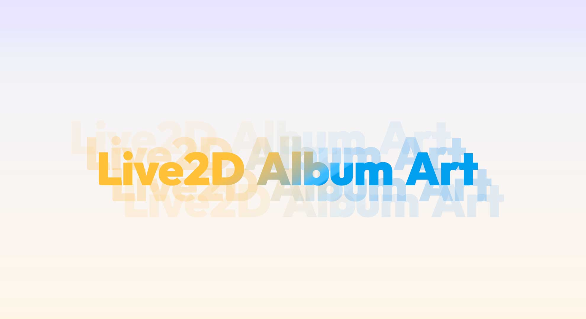
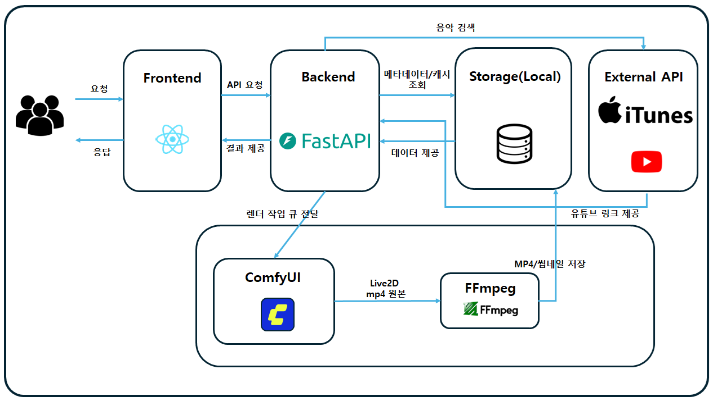
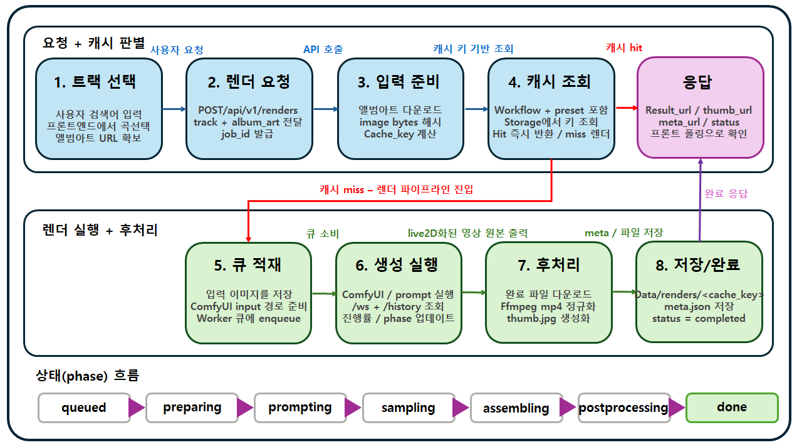

# Live2D Album Art

### 음악 검색 결과의 앨범아트를 Live2D 스타일 루프 영상(MP4)으로 자동 생성하는 서비스

 

<!-- ✅ Links -->

  <a href="PASTE_PRESENTATION_VIDEO_LINK" target="_blank"><b>발표영상</b></a>
  &nbsp;•&nbsp;
  <a href="PASTE_PRESENTATION_SLIDES_LINK" target="_blank"><b>발표자료</b></a>
  &nbsp;•&nbsp;
  <a href="PASTE_WRAPUP_REPORT_LINK" target="_blank"><b>랩업 리포트</b></a>

 

<!-- ✅ Tech Stack Badges -->

---

## 목차
- [프로젝트 소개](#프로젝트-소개)
- [결과물](#결과물)
- [주요 기능](#주요-기능)
- [핵심 문제와 해결](#핵심-문제와-해결)
- [시스템 아키텍처](#시스템-아키텍처)
- [생성 파이프라인](#생성-파이프라인)
- [API 개요](#api-개요)
- [Links](#links)
- [팀원 소개](#팀원-소개)
- [Future Work](#future-work)

---

## 프로젝트 소개
좋아하는 노래를 재생할 때, 앨범아트도 음악처럼 함께 살아 움직일 수 없을까에서 시작한 프로젝트입니다.  
한 장의 정적인 커버 이미지에 Live2D 스타일의 미세한 움직임을 더해, "듣는 경험"을 "보는 경험"으로 확장하는 것을 목표로 했습니다.

사용자는 곡을 검색하고 트랙을 선택하기만 하면 됩니다.  
그 이후에는 시스템이 앨범아트를 분석해 루프 가능한 MP4와 썸네일, 메타데이터(`meta.json`)를 자동으로 생성해 제공합니다.

---

## 결과물
예시 트랙: **MONKEY HOTEL - 잔나비**

| 원본 앨범아트 | 생성 결과 (Live2D Loop) |
|---|---|
|  |  |

- 정적 앨범아트의 구도/텍스트를 유지한 채, 미세 모션이 반복되는 루프 영상으로 변환
- 결과물 형식: 최종 산출은 `MP4`이며, 문서에는 비교를 위해 `GIF`를 사용
- Demo URL: `<배포 링크>`

---

## 주요 기능
- iTunes 검색 기반 트랙 후보 조회(기본 상위 3개)
- YouTube Data API 기반 보조 메타 수집(임베드 URL/조회수) 및 점수화
- FastAPI 비동기 렌더 Job Queue 처리
- 이미지 바이트 + 워크플로우 버전 + 프리셋 기준 캐시 키 생성으로 중복 렌더 방지
- ComfyUI 워크플로우 호출 및 결과물 다운로드
- FFmpeg 후처리(`video.mp4` 정규화, 썸네일 `thumb.jpg` 생성)
- 렌더 상태 폴링(phase/progress/queue position) 및 히스토리 조회

---

## 핵심 문제와 해결
### 1) 앨범아트 정체성 유지
생성 결과가 아무리 화려해도 원본 앨범아트의 인물 비율이나 로고 위치가 달라지면, 사용자 입장에서는 "내가 고른 앨범"이라는 감각이 사라졌습니다.  
초기 실험에서 가장 많이 본 실패가 바로 이 지점이었고, 단순 프롬프트 튜닝만으로는 편차를 줄이기 어려웠습니다.

그래서 파이프라인의 기준을 "새 이미지를 만들기"가 아니라 "원본 구조를 유지한 채 미세 모션만 추가하기"로 잡았습니다.
- 앨범아트를 조건 이미지로 고정 입력해 프레임 생성의 기준축을 유지
- 카메라를 고정 구도로 제한해 줌/팬/틸트로 인한 프레이밍 변화 차단
- `WanVideoLoraSelectMulti`에서 LoRA 3종 동시 적용  
  (`livewallpaper_wan22_5b_TI2V_000005000.safetensors`, `live2d_wan2.2.safetensors`, `step-6450.safetensors`)
- 전용 학습 LoRA(`live2d_wan2.2`,`step-6450`)를 포함해 형태 보존과 Live2D 질감의 균형 확보

이후에는 원본 커버의 정체성을 유지하면서도 "움직이는 앨범아트"로 자연스럽게 인지되는 결과를 안정적으로 얻을 수 있었습니다.

### 2) 끊김 없는 루프(Seamless Loop)
루프 영상에서 가장 거슬리는 지점은 마지막 프레임이 처음 프레임으로 돌아가는 순간이었습니다.  
프레임별 품질이 좋아도 경계에서 속도와 위상이 어긋나면 점프 컷처럼 느껴졌고, 이건 별도 처리 없이는 해결되지 않았습니다.

우리는 루프 경계를 하나의 독립 문제로 보고, 전환 구간을 재구성한 뒤 보간하는 방식을 택했습니다.
- WhiteRabbit 계열 커스텀 노드 `PrepareLoopFrames` -> `AssembleLoopFrames`로 루프 조립용 시퀀스 구성
- `RIFE VFI`(multiplier 4)로 경계 구간 중간 프레임 보강
- `VHS_VideoCombine`으로 최종 영상화해 반복 재생 시 이질감 완화

그 결과, 여러 번 반복 재생해도 경계가 덜 튀는 자연스러운 loop 품질을 확보했습니다.

### 3) 긴 생성 시간과 중복 요청
렌더 1건이 수분 단위로 걸리다 보니, 같은 앨범아트 요청이 반복되면 대기열이 빠르게 길어졌습니다.  
사용자 입장에서는 "기다리고 있는데 또 기다린다"는 체감이 생겼고, 시스템 입장에서는 같은 작업을 반복하며 GPU를 낭비하게 됐습니다.

해결 방향은 명확했습니다. 중복 작업은 아예 실행하지 않고, 새로운 작업만 큐에서 처리하도록 흐름을 분리했습니다.
- 이미지 바이트 + `workflow_version` + `render_preset` 기반 캐시 키 생성으로 동일 입력 식별
- 캐시 히트는 즉시 `completed` 반환, 캐시 미스만 워커 큐로 전달
- `queued -> preparing -> prompting -> sampling -> assembling -> postprocessing -> done` 단계/진행률을 노출해 대기 체감 완화

이 구조로 바꾼 뒤에는 중복 요청 응답이 즉시 처리되고, GPU 자원을 실제 신규 생성 작업에 집중할 수 있었습니다.

---

## 시스템 아키텍처

  

---

## 생성 파이프라인

  

1. 사용자가 검색어 입력 후 트랙 선택
2. `POST /api/v1/renders`로 렌더 Job 생성
3. 백엔드가 앨범아트 다운로드 후 캐시 키 계산
4. 캐시 존재 시 즉시 결과 URL 반환
5. 캐시 미존재 시 입력 이미지를 ComfyUI input에 저장하고 큐에 적재
6. 워커가 ComfyUI `/prompt` 실행 후 진행률 수집
7. 완료 파일 다운로드 후 MP4 변환/썸네일 생성
8. `meta.json` 저장 및 상태 `completed`로 업데이트

상태(phase) 흐름:
`queued -> preparing -> prompting -> sampling -> assembling -> postprocessing -> done`

---

## ComfyUI 내부 파이프라인

  

---

## API 개요
이 프로젝트는 아래 API들을 조합해 동작합니다.

- **iTunes Search API**: 곡/아티스트 검색 결과와 앨범아트 메타데이터 수집
- **YouTube Data API v3**: 임베드 가능한 영상 ID/조회수 기반 보조 신호 수집
- **ComfyUI API (HTTP + WebSocket)**: 프롬프트 실행(`/prompt`), 히스토리 조회(`/history/{prompt_id}`), 진행 상태 스트리밍(`/ws`)
- **내부 FastAPI API**: 검색, 렌더 생성, 상태 조회, 히스토리 관리 등 프론트엔드-백엔드 통신

---

## 팀원 소개

<table align="center">
  <tr>
    <td align="center">
       
      <b>최호준</b> 
      <a href="https://github.com/Subakmat">@Subakmat</a> 
      LoRA 학습 설계
    </td>
    <td align="center">
       
      <b>양지훈</b> 
      <a href="https://github.com/YangJH01">@YangJH01</a> 
      Loop 방식 설계
    </td>
    <td align="center">
       
      <b>고재완</b> 
      <a href="https://github.com/kjaewan">@kjaewan</a> 
      웹 설계
    </td>
    <td align="center">
       
      <b>고대영</b> 
      <a href="https://github.com/Dae0Kkomi">@Dae0Kkomi</a> 
      Workflow 설계
    </td>
  </tr>
</table>

---

## Future Work
- 모델 경량화(생성에 걸리는 시간 감소)
- DB 연결
- 오디오 정보도 받아서 오디오가 생성 이미지에 영향을 주도록 설정
- 16:9 해상도로도 출력할 수 있도록 지원
- ComfyUI에 의존하지 않는 자체 파이프라인 구축하기
